# Lv.3 NLP -10 (Fin-GPT) : 최종 프로젝트 (뇌뺴고 경제 뉴스 읽기) 

</div>


# 1. 프로젝트 개요 
## 1.1. 프로젝트 소개
 `뇌빼고 경제 뉴스` 프로젝트는 온라인 경제 뉴스 기사를 모아 중요한 내용을 쉽고 빠르게 파악할 수 있도록 하는 프로젝트 입니다.   
 저희 프로젝트는 아래와 같은 서비스를 제공합니다.    
✅중복되는 내용의 여러 뉴스들을 모아 기간별/기업별로 주요 토픽과 뉴스 요약문을 제공합니다.    
✅뉴스의 긍부정 정보와 주가 현황 등 기업별로 정리된 금융 정보를 제공합니다.  
✅여러 경제 지표와 기업별 주요 토픽을 정리한 일일 리포트를 제공합니다.  


## Fin-GPT
<div align='center'>

|권예진 [](https://github.com/Becky-Kwon)|문지원 [](https://github.com/jwmooon)|방제형 [](https://github.com/BJH9)|이경재 [](https://github.com/EbanLee)|이종원 [](https://github.com/jongwoncode)|
|:-:|:-:|:-:|:-:|:-:|
|</img>|</img>|</img>|</img>|</img>|

</div>

## 역할 분담

<div align='center'>

|팀원| 역할 |
|:---:| --- |
| 권예진 | DB ERP 설계, DB 구축 및 관리, 데이터 수집, 웹 페이지 디자인, 백엔드 API 개발, 발표 자료 제작 |
| 문지원 | 프론트엔드 개발, API 연동, 감성분석 모델 학습, 웹 페이지 디자인 |
| 방제형 | DB ERP 설계, DB 구축 및 관리, 백엔드API 개발, 프론트엔드 개발, API 연동 |
| 이경재 | EC2 서버 구축, 학습데이터조사, 요약모델 학습 및 개선, 요약문 임베딩, 클러스터링, 토픽생성 기획 및 구현 |
| 이종원 | PM, DB ERP 설계, Data Pipeline 구축, 자동화 과정 설계, 요약 모델 학습 |

</div>


## 프로젝트 구조도

<div align='center'>

</img>

</div>

## 개발/협업 환경

### 하드웨어
> **Tesla V100 32GB** * 5EA

### 소프트웨어 및 라이브러리
```
pandas==1.1.5
scikit-learn~=0.24.1
transformers==4.10.0
torch==1.10.0
```
### GitHub
현업에서 진행하는 방식을 최대한 따르려고 노력했습니다. 이슈와 PR 템플릿을 작성하고, 팀 내의 커밋 컨벤션 규칙을 작성하여 후에 봐도 통일된 모습으로 쉽게 변경 사항을 찾을 수 있도록 했습니다. 기본 템플릿을 main 브랜치로 둔 뒤에, dev 브랜치에서 개발을 진행하였습니다. dev 브랜치에서도 새로운 기능을 개발할 때는 새로운 브랜치로 분기를 만들어 진행한 뒤 작성이 끝나면 dev 브랜치로 Pull Request를 작성하고, 팀원의 리뷰를 받은 뒤 병합을 진행하였습니다.

### Notion
메인 Task 보드를 두고, 그곳에 자신의 업무 페이지를 작성하여 담당자를 할당한 후, 태그를 준비/진행 중/완료로 나누어 진행 상황을 공유했습니다. 해당 페이지에는 본인의 작업 기간을 표시하여 타임라인으로도 활용했습니다.
그리고 정보와 자료의 공유 공간으로 사용했습니다. 자신은 익숙하지만, 팀원들은 모를 수 있는 팁을 직접 작성하기도 하고, 팀원들이 읽어봤으면 하는 레퍼런스를 공유했습니다.

### 프로젝트 템플릿
주어진 Baseline 코드는 모델, 데이터로더, 학습까지 하나의 파일에 전부 작성되어 있었습니다. 앞으로 진행할 다른 대회에도 사용할 수 있도록 프로젝트 템플릿을 작성하여 그에 맞게 모듈화하여 구획하였습니다. 디렉토리는 원활한 실험을 위한 설정 파일을 담은 config, 학습, 검증, 평가, 증강 데이터를 담은 data, 학습이 끝난 모델과 inference 결과를 저장하는 output, 학습된 모델의 파라미터를 저장하는 checkpoint, Jupyter Notebook 작업을 수행하는 notebook, 데이터 전처리와 증강 등 다양한 곳에 사용한 모듈을 저장하는 utils으로 구분했습니다. 
```
📦 level2-klue-nlp-10-RelationExtraction
├─ .github
│  ├─ .keep
│  ├─ ISSUE_TEMPLATE
│  │  ├─ bug_report.md
│  │  ├─ experiment.md
│  │  └─ feature_request.md
│  └─ PULL_REQUEST_TEMPLATE.md
├─ README.md
├─ code
│  ├─ .DS_Store
│  ├─ augmentation.py
│  ├─ best_model
│  │  └─ .ipynb_checkpoints
│  │     └─ empty.txt
│  ├─ custom_trainer.py
│  ├─ data_analysis.py
│  ├─ datasets.py
│  ├─ dict_label_to_num.pkl
│  ├─ dict_num_to_label.pkl
│  ├─ ensemble.py
│  ├─ inference.py
│  ├─ logs
│  │  └─ empty.txt
│  ├─ loss_function.py
│  ├─ metrics.py
│  ├─ model.py
│  ├─ prediction
│  │  ├─ .ipynb_checkpoints
│  │  │  └─ sample_submission-checkpoint.csv
│  │  └─ sample_submission.csv
│  ├─ preprocessing.py
│  ├─ requirements.txt
│  ├─ results
│  │  └─ empty.txt
│  ├─ split_data.py
│  ├─ train.py
│  └─ utils.py
└─ img
```

## 프로젝트 로드맵

<div align='center'>

</img>

</div>

<br>

## 데이터 
### Label 별 데이터셋 특징


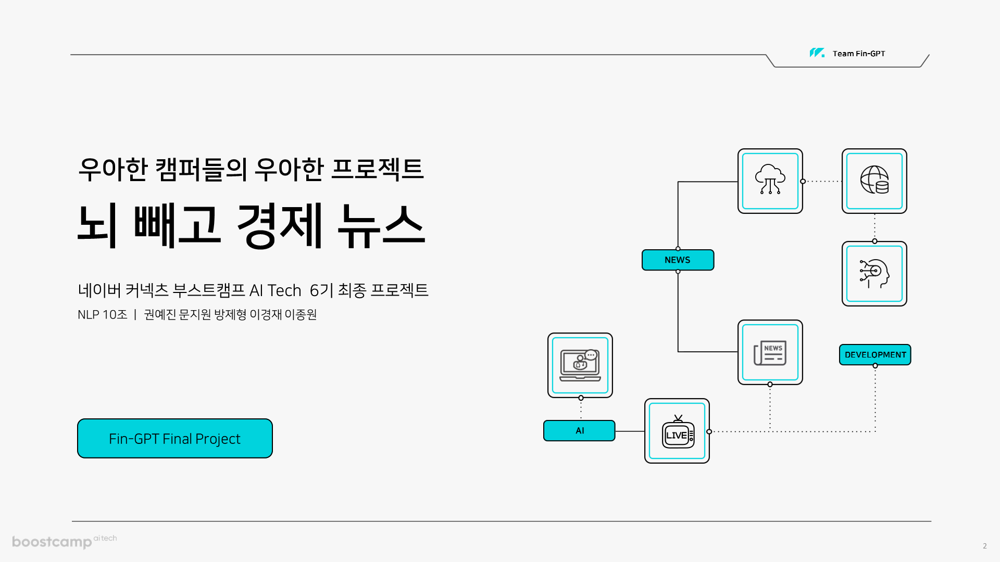
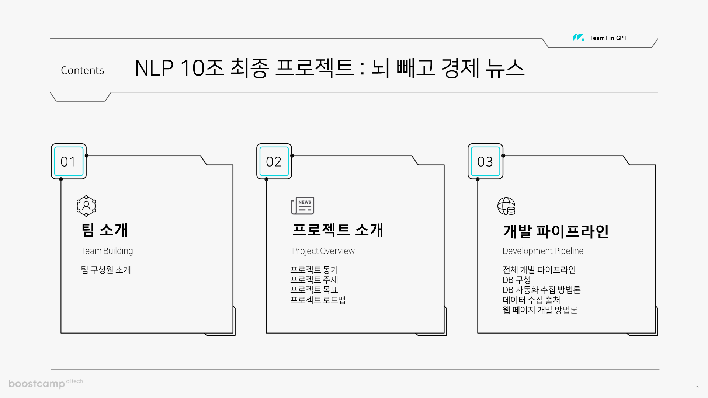
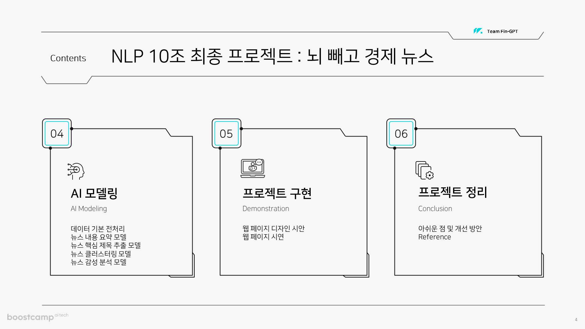
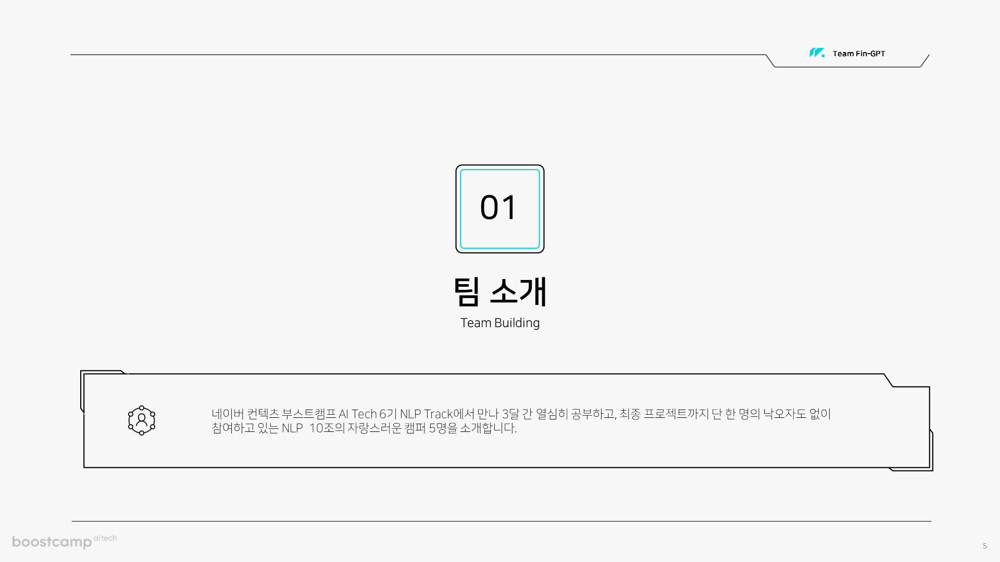
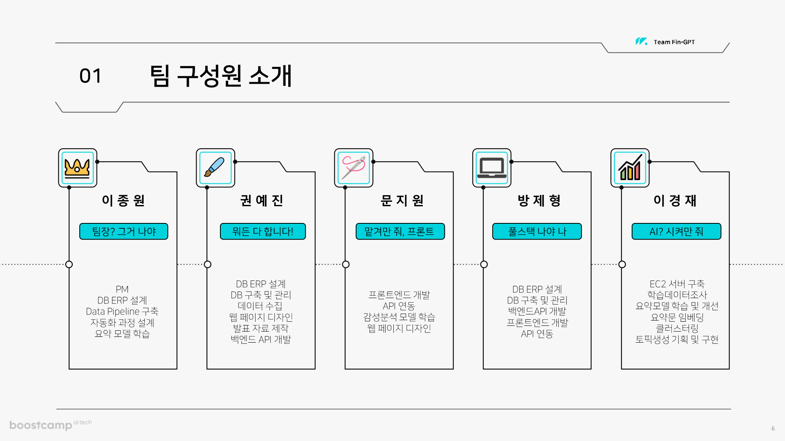


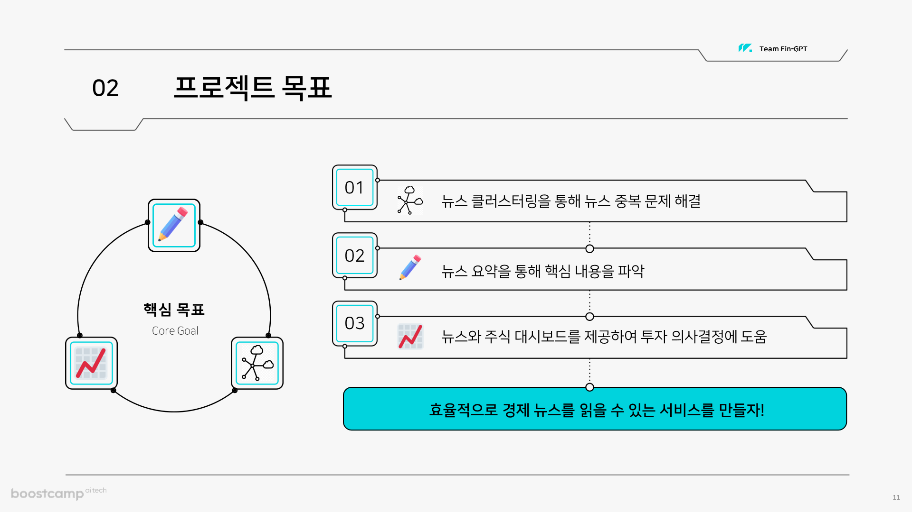

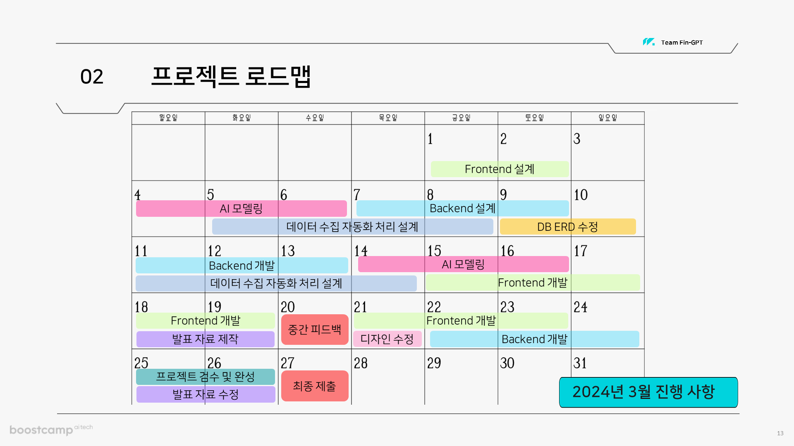
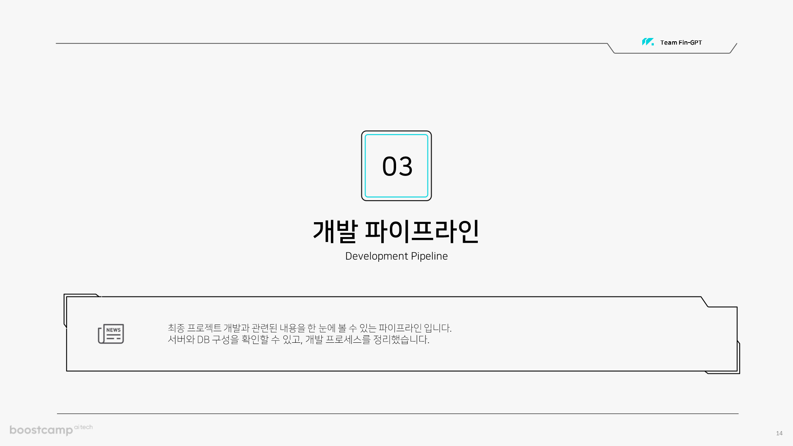

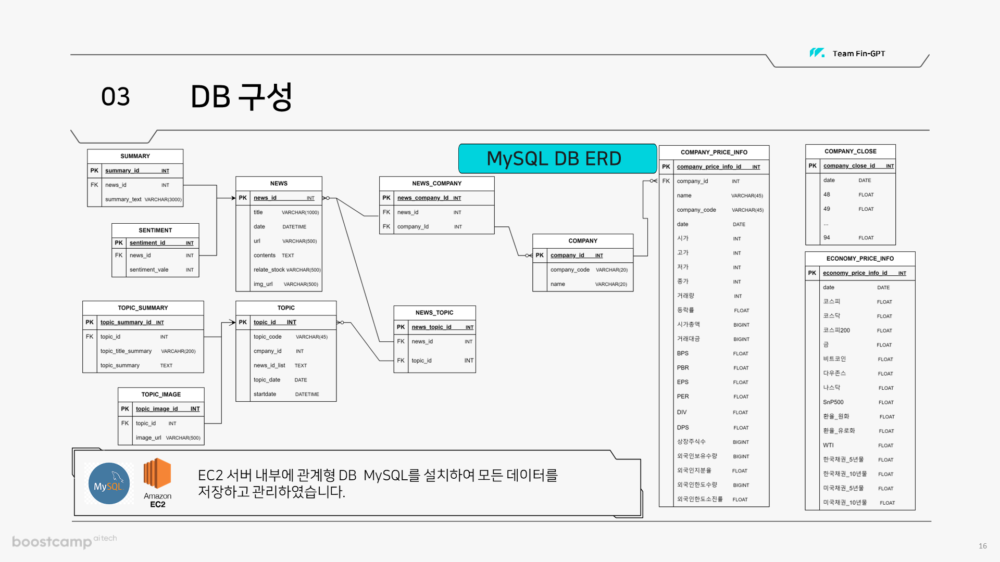


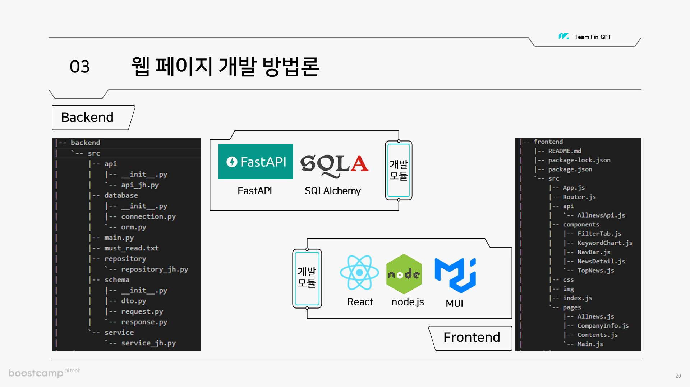


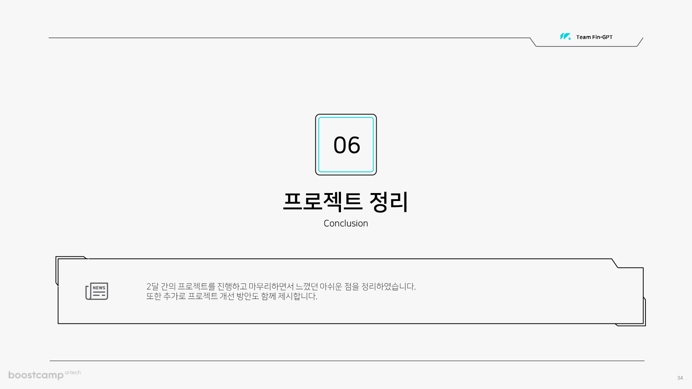

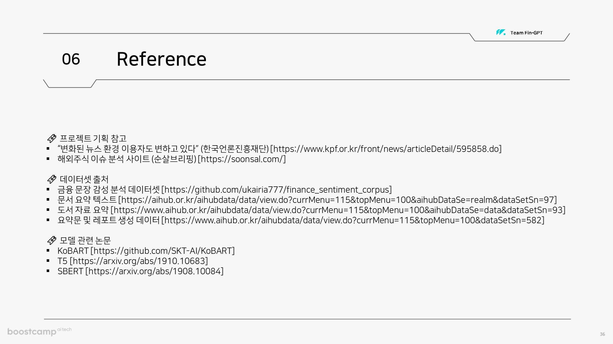

